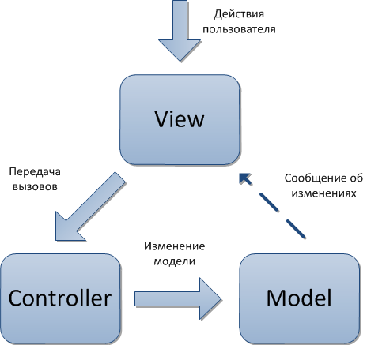
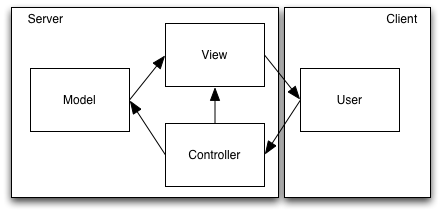
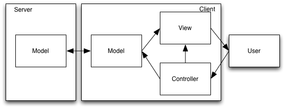
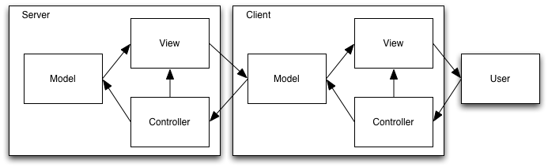
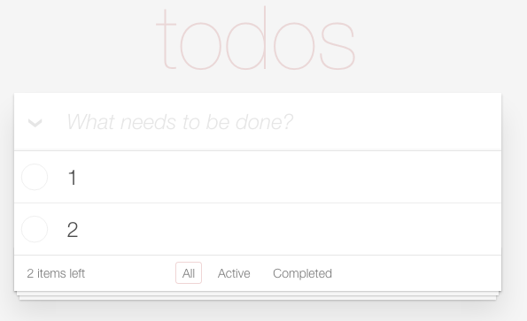
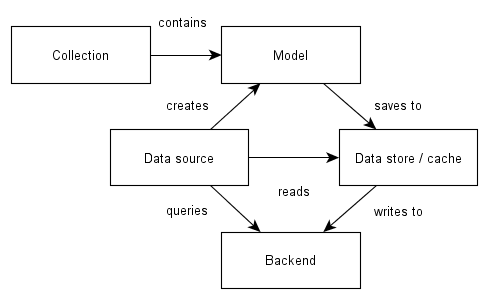
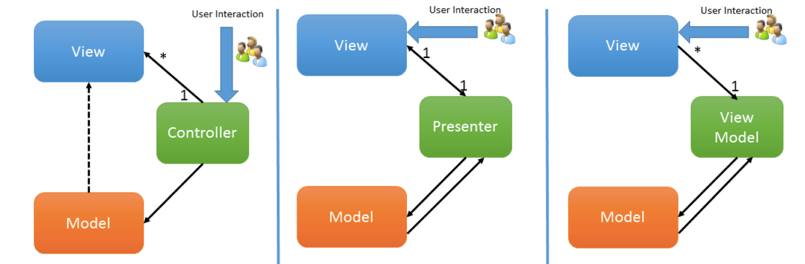

---

layout: default

---

# Яндекс

## **{{ site.presentation.title }}** {#cover}





	
{{ site.author.name }},   {{ site.author.position }}

## &nbsp;
{:.section}

### Разминка

## Какие есть типы в JS?

* ...Number
* ...String
* ...Boolean
* ...Undefined
* ...Null
* ...Object
* ...Symbol

## Что возвращает typeof?

* Number → ...number
* String → ...string
* Boolean → ...boolean
* Undefined → ...undefined
* Null → ...object
* Symbol → ...symbol
* Object → ...object
* ...Function → ...function

## Как проверить тип переменной `t`?

* Number, String, Boolean → ...`typeof t`
* ...undefined, null → ...`t === undefined, null`
* ...Массив → ...`Array.isArray(t)`
* ...Объект → ...`typeof t`...`, Object(t) === t`

## Что будет в консоли?

~~~javascript
var i = 10;
var array = [];

while (i--) {
    array.push(function() {
        return i + i;
    });
}

console.log([
     array[0](),
     array[1](),
])
~~~

...[-2, -2]

## Как вывести `yandex` вызвав функцию `fn`

~~~javascript
var obj = {x: 'yandex'}
function fn() { console.log(this.x); }
~~~

...fn.call(obj);

...fn.apply(obj);

...fn.bind(obj)();

## Зачем нужны паттерны?

* ...Не нужны для маленького приложения
* ...Эффективно решать однотипные проблемы
* ...Для быстрого понимания кода

## &nbsp;
{:.section}

### MVC

## Состав компонент
{:.right-image}

* Model
* View
* Клей (Controller, Presenter, Router)

## &nbsp;
{:.section}

### Клиент-серверный MVC

## Серверный рендеринг

* ...Только сервер генерит html
* ...Быстрая шаблонизация и кэширование
* ...Отсутствие динамики
* ...Актуальная серверная модель
* ...Сокрытие бизнес-логики

// Примеры сайтов с серверным рендерингом

## Клиентский рендеринг

* ...Долгая первоначальная отрисовка страницы
* ...Не рабочий сайт при отключенном JS
* ...Интерактивность
* ...Открытая бизнес-логика
* ...Синхронизация модели

## Клиент-серверный рендеринг

* ...Быстрая первоначальная загрузка
* ...Работает при отключении JS
* ...Интерктивность
* ...Сокрытие нужной части бизнес-логики
* ...Синхронизация модели

// Нравится последний подход, говорить будем только про MVC на клиенте

## Домашнее задание

* Написать собственный MVC
* Написать TodoMVC

## Клиентский MVC
{:.section}

### View (представление)

## Что такое представление?

* HTML
* Биндинги
* Состояние
* Перерисовка

## Задача

* Отрендерить шаблон / подвязаться к html
* Обновление представления новыми данными
* Подписка на пользовательские события

## Анализ альтернатив

* ...Низкая или высокая интерактивность
* ...Сервер поставляет разметку или данные
* ...Первичность модели или разметки (чтение из DOM)
* ...Гранулярность обновления (представление, элемент, строка)
* ...CSS или собственные селекторы биндингов

## Клиентский MVC
{:.section}

### Model

## Состав

## Задача

* ...Хранить состояние приложения
* ...Получать / обновлять состояние на сервере
* ...Не допускать дублирования сущностей
* ...Генерировать событие при изменении (альтернативы?)
* ...Изменение вложенных моделей

## Клиентский MVC
{:.section}

### Controller

## Задача

* ...Роутинг приложения
* ...Стейт приложения (онлайн, офлайн)
* ...Связь модели и представления

## Клиентский MVC
{:.section}

### Альтернативы

## MVC, MVP, MVVM

[MV*](https://addyosmani.com/blog/understanding-mvc-and-mvp-for-javascript-and-backbone-developers/)

## &nbsp;
{:.section}

### Собственный MVC

## С чего начать

* ...Модульность → ...CommonJS модули + browserify
* ...Событийная модель → ...EventEmitter + listenTo
* ...Шаблонизация → ...ES6 шаблоны
* ...Работа с API → ...абстракция над LocalStorage
* ...Клиентский роутинг → ...historyAPI
* ...Выделение компонентов и определение ответственности

[SPA](http://singlepageappbook.com/)
<i>Без части implementing</i>

[TodoMVC](http://todomvc.com/)

[TodoMVC template](https://github.com/hse2016/todomvc-app-template)

## &nbsp;
{:.section}

### Вопросы?
